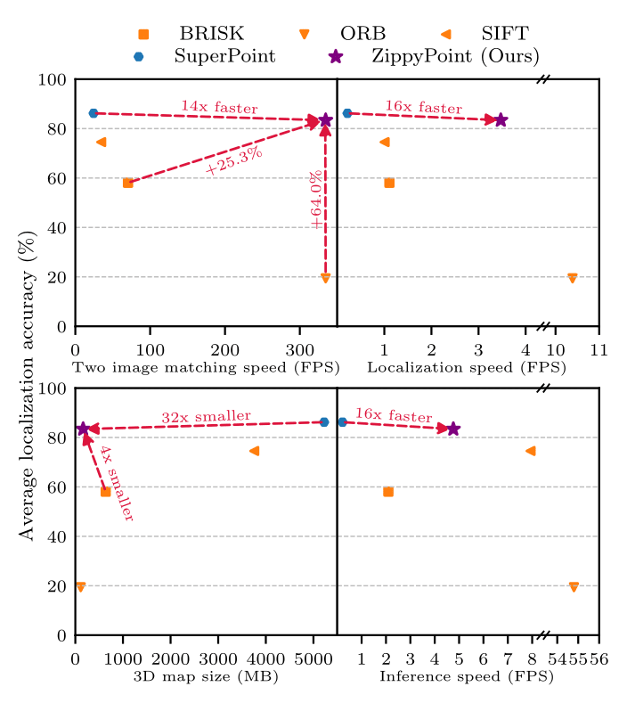

# ZippyPoint: Fast Interest Point Detection, Description, and Matching through Mixed Precision Discretization

This is the official repository of [ZippyPoint](https://arxiv.org/pdf/2203.03610.pdf).
ZippyPoint is an efficient detection and description neural networks for mobile or robot platforms.
We utilize network quantization to enable realtime inference on computationally limited platforms.
In addition, we propose the use of a binary descriptor normalization layer during the network optimization,
enabling the generation of distinctive binary descriptors, 
essential for efficient descriptor matching.

<p align="center">

</p>

This repository contains the "fake" quantized model based on [TensorFlow](https://www.tensorflow.org/) and [Larq](https://github.com/larq/larq),
alongside an image matching demo.
The generation of the quantization model relies on the [Larq Compute Engine (LCE)](https://github.com/larq/compute-engine).
Please refer to [LCE](https://github.com/larq/compute-engine) for instructions on how to convert our ZippyPoint model
for efficient deployment on your hardware platform of choice.

## Dependencies

* Python 3 >= 3.8
* TensorFlow >= 2.4
* Larq >= 0.12.2
* OpenCV >= 3.4
* Matplotlib >= 3.1
* NumPy >= 1.18

## Demo

Simply run the following command:

```
python demo.py --output_dir ./tmpdir/
```

## Citation

If you use this code or models, please consider citing our paper:

```
@inproceedings{kanakis2023zippypoint,
  title={ZippyPoint: Fast Interest Point Detection, Description, and Matching through Mixed Precision Discretization},
  author={Kanakis, Menelaos and Maurer, Simon and Spallanzani, Matteo and Chhatkuli, Ajad and Van Gool, Luc},
  booktitle={Proceedings of the IEEE/CVF Conference on Computer Vision and Pattern Recognition},
  pages={6113--6122},
  year={2023}
}
```

## Acknowledgements

This demo is based on that of [SuperGlue](https://github.com/magicleap/SuperGluePretrainedNetwork)