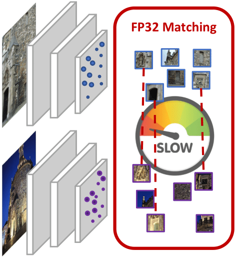
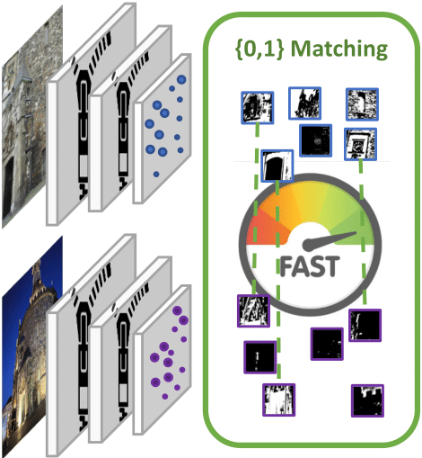

# ZippyPoint: Fast Interest Point Detection, Description, and Matching through Mixed Precision Discretization

This is the official repository for the paper [ZippyPoint: Fast Interest Point Detection, Description, and Matching through Mixed Precision Discretization](https://arxiv.org/pdf/2203.03610.pdf).
It contains the ZippyPoint network, implemented in [TensorFlow](https://www.tensorflow.org/) and [Larq](https://github.com/larq/larq). 
The efficient inference of ZippyPoint relies on the [Larq Compute Engine (LCE)](https://github.com/larq/compute-engine) 

Slow FP32 model        |  Fast mixed-precision model (ours)
:----------------------------------------------------------:|:----------------------------------------------------------:
   |  

## Abstract

Efficient detection and description of geometric regions in images is a prerequisite in visual robotic systems for localization and mapping.
Such systems still rely on traditional hand-crafted methods for efficient generation of lightweight descriptors, a common limitation of the more powerful neural network models that come with high compute and specific hardware requirements.
In this paper we focus on the adaptations required by detection and description neural networks to enable their use in mobile or robot platforms. 
To that end, we investigate and adapt network quantization techniques for enabling real-time inference. 
In addition, we revisit common practices in descriptor quantization and propose the use of a binary descriptor normalization layer, enabling the generation of distinctive binary descriptors with a constant number of ones.
ZippyPoint, our efficient network, runs at 47.2 FPS on the Apple M1 CPU.
This is up to 5x faster than the equivalent full-precision model while yielding minor performance degradation.
ZippyPoint consistently outperforms alternative binary detection and descriptor methods in two tasks, homography estimation and visual localization. 

## Installation / Setup

TODO...

## Citation

If you use this code or models, please consider citing our paper:

```
@article{maurer2022zippypoint,
  title={ZippyPoint: Fast Interest Point Detection, Description, and Matching through Mixed Precision Discretization},
  author={Maurer, Simon and Kanakis, Menelaos and Spallanzani, Matteo and Chhatkuli, Ajad and Van Gool, Luc},
  journal={arXiv preprint arXiv:2203.03610},
  year={2022}
}
```